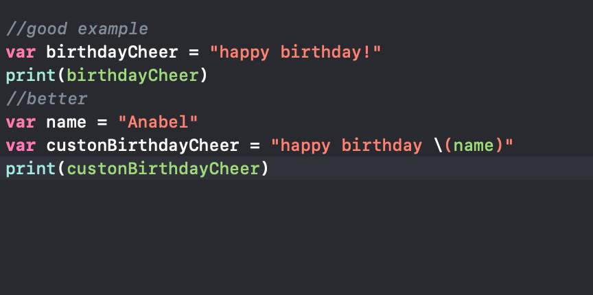

# Week Three: Learning Swift!

Swift is a easy language to learn in the part of actually coding 
but the part that I am strugging with is learing how to navigate 
around Xcode. Xcode is the app that I am using to code along with 
the lessons that I am following and where I am ultimatly going to code
the app. I am still tinkering with what I am learning. 

How I am learning swift is by watching and reading the lessons provided by 
A website called Udacity! I am following the Swift for Beginners lessons. 
There are a total of 4 different lessons : Variables and types, Strings, If statements, and Functions

## Lesson 1: Variable!

